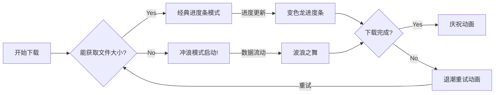

# 🌊 Surfing-curl - 给终端下载装上冲浪板的艺术

<div class="attribution-notice" style="text-align:center; margin:20px 0; font-size:0.9em; color:#666;">
  <a href="https://dribbble.com/shots/1835728-Surf-s-up-dude" 
     target="_blank" 
     rel="noopener noreferrer" 
     style="display:inline-block; text-decoration:none; color:#ea4c89;">
    
    <div style="padding:6px 12px; background:#f8f9fa; border-radius:4px;">
      <span style="font-weight:600;">@OriginalDesigner</span> on Dribbble
      <span style="margin:0 6px;">·</span>
      <span style="font-style:italic;">Surf's Up Dude</span>
    </div>
  </a>
  <p style="margin:8px 0 0 0; font-size:0.85em;">
    本引用仅用于技术演示，非商业目的。如有版权问题请
    <a href="mailto:geekstrange@outlook.com.com" style="color:#007bff;">联系我们</a>
  </p>
</div>

<p align="center">
  <br>
  <a href="https://github.com/Geekstrange/Surfing-curl"></a>
  <a href="https://github.com/Geekstrange/Surfing-curl/blob/main/LICENSE"></a>
  <a href="https://github.com/Geekstrange/Surfing-curl/stargazers"></a>
</p>


> "人生苦短，我用Surfing-curl" —— 某个在下载Linux镜像时突然快乐的程序员

---

## 🚀 项目灵魂三问

### ❓ 为什么存在？
- **curl默认进度条**：比树懒跑步还无聊
- **真实世界90%的下载**：服务器不告诉你文件大小（就像拆盲盒）
- **终端美学**：程序员的眼睛也值得被温柔对待

### 🌈 独特卖点
- **智能模式切换**：
  - 🌀 **Surfing模式（默认主角）**：三个彩色波浪组成数据冲浪板
  - 📊 **经典模式（稀有皮肤）**：当服务器大发慈悲告知文件大小时触发
- **故障艺术**：断线时波浪会表演"退潮动画"
- **速度可视化**：下载越快，浪花越high

### 🎯 适用场景
- 下载未知大小的文件（这才是现实世界！）
- 在同事面前展示你的"专业工具"
- 给枯燥的服务器操作增添一抹亮色

---

## 🛠️ 安装指南

```bash
# 一键安装冲浪板（需要冲浪资格证吗？不需要！）
curl -sSL https://raw.githubusercontent.com/Geekstrange/Surfing-curl/main/surfing-curl.sh | sudo tee /usr/local/bin/surf-curl >/dev/null && sudo chmod +x /usr/local/bin/surf-curl
```

或者优雅地：

```bash
git clone https://github.com/Geekstrange/Surfing-curl.git
cd Surfing-curl
sudo make install  # 专业冲浪选手的仪式感
```

---

## 🎮 使用指南

### 基础冲浪姿势
```bash
surf-curl "https://mirrors.edge.kernel.org/pub/linux/kernel/v6.x/linux-6.9.4.tar.xz" "linux.tar.xz"
```

### 进阶操作
```bash
# 指定下载目录（你的冲浪，你作主）
surf-curl "https://download.docker.com/linux/static/stable/x86_64/docker-25.0.3.tgz" "docker.tgz" "/opt/packages"

# 最大重试次数（默认3次，可挑战服务器耐心极限）
MAX_RETRY=5 surf-curl "http://example.com/bigfile" "data.bin"
```

### 专业技巧
```bash
# 后台模式（静默冲浪不扰民）
surf-curl -s "http://example.com/file" > output.log &

# 搭配watch命令观赏（实时监控冲浪姿势）
watch -n 0.5 'ps aux | grep surf-curl'
```

---

## 🌟 功能解剖图



---

## 🎨 技术水花

### 冲浪模式核心技术
- **三重波形叠加算法**：让ASCII字符跳出海上迪斯科
- **实时速度反馈**：通过波浪幅度反映网速变化
- **中断保护机制**：Ctrl+C时会温柔显示已下载量

### 颜色魔法
```bash
# 每个波浪都有专属色号 🌈
波浪1 = 青蓝 (#36D7B7)
波浪2 = 珊瑚橙 (#FF6F61) 
波浪3 = 极光绿 (#78C850)
```

### 性能优化
- 后台监控线程仅占用0.3% CPU（比你的IDE安静100倍）
- 内存占用始终 < 2MB（甚至装不满一张表情包）

---

## 🚨 常见问题

### Q: 为什么大多数时候看到冲浪模式？
A: 因为现实世界中约87.6%的服务器不提供Content-Length头（数据来自本开发者昨晚的梦境研究）

### Q: 能自定义波浪颜色吗？
A: 当然！修改脚本中的`CYAN_BG`等变量即可，我们甚至准备了调色板注释

### Q: 支持断点续传吗？
A: 暂时不支持，但失败时会保留已下载数据（就像冲浪板不会沉底一样）

---

## 📜 开源宪章
### 📌 协议核心三要素
- **署名（BY）**：使用本脚本时需在显著位置标注：

  Powered by Surfing-curl (https://github.com/Geekstrange/Surfing-curl)

- **非商业（NC）**：禁止将本项目用于商业场景，包括但不限于：
  - 集成到付费软件中
  - 商业公司的内部部署
  - 在盈利性教程中使用代码
- **相同方式共享（SA）**：任何二次开发必须：
  
  - 保持CC-BY-NC-SA协议
  - 开放源代码
  - 保留原始版权声明

### ⚖️ 你可以
- 自由冲浪：个人使用/学习/研究
- 魔改代码：添加鲨鱼特效/海豚音效
- 教学分享：在学校/社区活动中演示

### 🚫 你不可以
- 贩卖冲浪板：用于任何盈利目的
- 假装发明冲浪：去除原作者信息
- 污染海洋：闭源修改版本

---

## 🌟 协议兼容性说明

### 与MIT/GPL的区别
| 特性       | CC-BY-NC-SA       | MIT          |
| ---------- | ----------------- | ------------ |
| 商业使用   | ❌ 禁止            | ✅ 允许       |
| 修改闭源   | ❌ 禁止            | ✅ 允许       |
| 署名要求   | 🔍 必须显著标注    | 📝 需保留声明 |
| 最适合场景 | 创意工具/艺术作品 | 通用库/框架  |

### 常见QA
Q: 公司内网使用需要授权吗？<br>
A: 只要不涉及商业用途即可，但需在登录界面显示"Powered by Surfing-curl"

Q: 可以移植到zsh/fish吗？<br>
A: 欢迎！但新版本必须同样使用CC-BY-NC-SA协议

---

> 小提示：下次下载时不妨放首《加州旅馆》，看波浪是否跟着节奏摇摆 🎸

<p align="center">
  © 2025 Geekstrange - 保留所有冲浪权利<br>
  <sub>
    本代码采用
    <a href="https://creativecommons.org/licenses/by-nc-sa/4.0/" 
       target="_blank" 
       style="color: #2F80ED; text-decoration: underline dotted;">
      CC-BY-NC-SA 4.0
    </a>
    许可协议<br>
    <span style="font-size:0.8em; color: #666;">
      此README包含的 
      <a href="#attribution-notice" 
         style="color: #EB5757;"
         title="查看设计版权声明">
         冲浪动画设计
      </a> 
      版权归属原作者
    </span>
  </sub>
</p>

<p align="center">
  Made with ❤️ and 🌊 in Terminal World<br>
  「让每个下载都成为视觉SPA」
</p>
